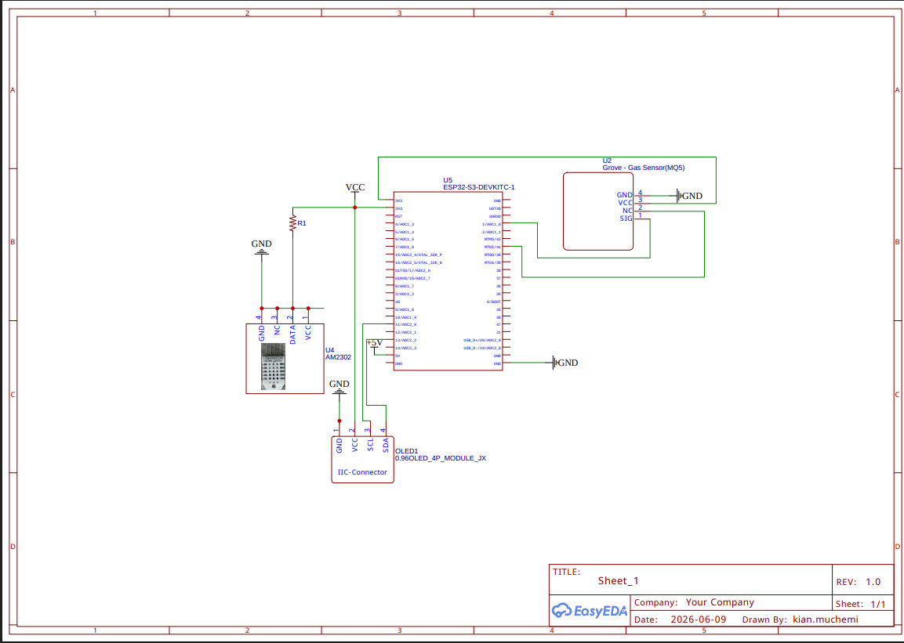
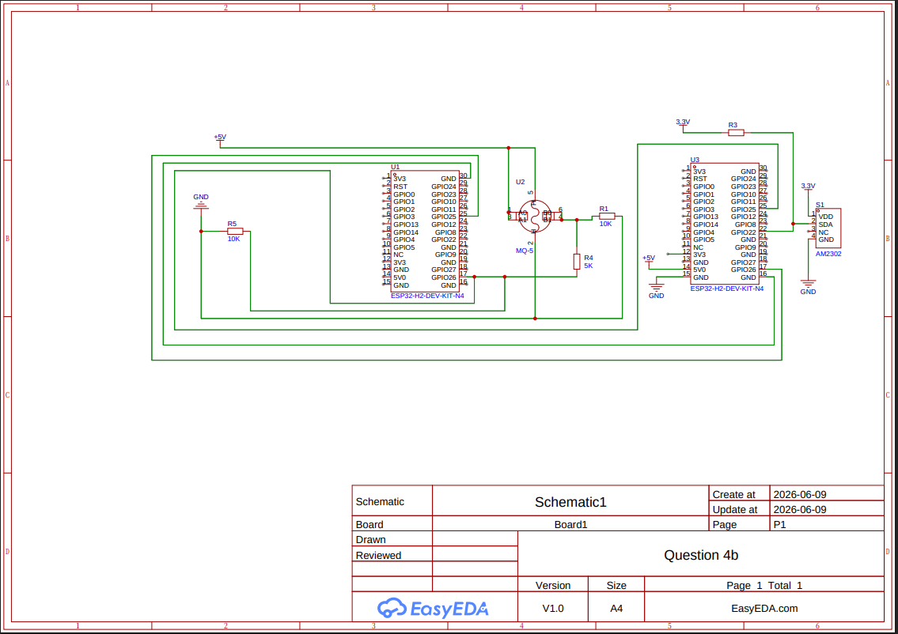
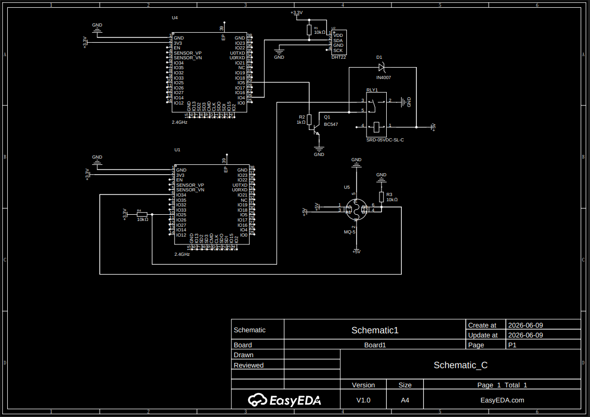

# ICS 4111: Embedded Systems & IoT
## Semester Project: Deliverable 1

**Assigned Flower:** Sunflower

## 1. Environmental Requirements for Sunflower Growth
Below is the research detailing the six essential environmental characteristics required for optimal growth:

* **Optimal Temperature Range:** Sunflowers thrive best in warm environments. The optimal daytime temperature is between **21°C and 30°C** (70°F to 86°F). Growth slows down drastically below 10°C, and prolonged exposure to temperatures above 35°C can cause heat stress and reduce overall health.
* **Optimal Relative Humidity Range:** The ideal relative humidity (RH) for sunflowers changes slightly across growth stages, but maintaining a range of **50% to 75%** is optimal. High humidity (>80%) inside a greenhouse increases the risk of fungal infections, while very low humidity (<40%) spikes transpirational water loss.
* **Recommended Soil Type:** Sunflowers grow best in well-draining, nutrient-rich **sandy loam or loamy soil**. They have deep taproots that require loose, uncompacted soil structures to anchor properly and forage for water. Heavy clay soils should be avoided as they waterlog easily.
* **Optimal Soil Moisture Content:** Sunflowers are moderately drought-tolerant but require consistent moisture for rapid growth and flowering. The optimal Volumetric Water Content (VWC) in the soil should be maintained between **40% and 60%** of field capacity. The soil should be moist but never soggy or saturated, as waterlogging induces root rot.
* **Optimal Soil pH Range:** Sunflowers prefer slightly acidic to neutral soils. The optimal soil pH range is **6.0 to 7.5**. This ensures maximum availability of essential macronutrients (Nitrogen, Phosphorus, Potassium) and micronutrients.
* **Suitable Sunlight Exposure:** Sunflowers are classic "long-day" plants. They require a minimum of **6 to 8 hours** of direct, bright sunlight daily. In a passive greenhouse design, maximizing light penetration during these peak hours is essential for healthy photosynthesis.

### Summary Reference Table
The following table serves as the team's primary reference baseline for establishing sensor threshold alerts in later stages of the project:

| Metric | Optimal Target Range | Greenhouse Hazard Thresholds |
| :--- | :--- | :--- |
| **Temperature** | 21°C – 30°C | $< 10^\circ\text{C}$ (Frost) / $> 35^\circ\text{C}$ (Heat Stress) |
| **Relative Humidity** | 50% – 75% | $< 40\%$ (Dry air) / $> 80\%$ (Fungal Risk) |
| **Soil Type** | Sandy Loam / Loam | Heavy Clay (Poor drainage) |
| **Soil Moisture** | 40% – 60% Field Cap. | $< 30\%$ (Wilting) / $> 80\%$ (Root Rot) |
| **Soil pH** | 6.0 – 7.5 | $< 5.5$ (Acidic block) / $> 8.0$ (Nutrient lock) |
| **Sunlight** | 6 – 8 Hours daily | $< 6$ Hours (Stunted growth/etiolation) |

## 2. Hardware Components

To build an embedded edge device capable of monitoring the metrics above—along with monitoring **LPG (Propane/Butane)** leaks originating from the greenhouse heating systems, the following components have been selected:

* **Microcontroller Board:** ESP32S DevKIT WiFi + BLE Module (30-Pin). Functions as the central processing edge unit, reading sensor data and utilizing its built-in Wi-Fi to send telemetry to the cloud platform.
* **Temperature & Humidity Sensor:** DHT22 (AM2302). Chosen for its high accuracy and wid measurement ranges ($-40^\circ\text{C}$ to $+80^\circ\text{C}$ temperature, 0-100% RH).
* **Gas Leak Sensor:** MQ-5 Gas Sensor. Specifically optimized for detecting LPG, natural gas and coal gas leaks. Essential for monitoring greenhouse heating systems powered by LPG.
* **Visual Display:** 1.3" White IIC 128x64 OLED LCD Display. Uses the $I^2C$ protocol to display localized real-time data readings directly in the greenhouse for field technicians.
* **Actuator Driver:** 5V 1-Channel Low-Level Trigger Relay Module. Used to isolate and switch external devices safely using low-voltage ESP32 GPIO pins.
* **Prototyping Framework & Tools:**
    * Solderless Breadboard (830 tie-points) for circuit layout.
    * $10\text{ k}\Omega$ pull-up resistor (for DHT22 data line integrity).
    * $1\text{ k}\Omega$ and $2\text{ k}\Omega$ resistors (to construct a 5V-to-3.3V logic level voltage divider for the MQ-5 output).

## 3. Datasheets and Product Documentation Links

Below are the structural documentation references for our system's components:

1. **ESP32S DevKIT WiFi + BLE Module (30Pin)** = [Espressif Systems ESP32-WROOM-32 Official Datasheet](https://www.espressif.com/sites/default/files/documentation/esp32-wroom-32_datasheet_en.pdf)
2. **DHT22 AM2302 Temperature and Humidity Sensor** = [Adafruit AM2302 / DHT22 Product Specs & Datasheet](https://cdn-shop.adafruit.com/datasheets/DHT22.pdf)
3. **1.3" White IIC 128X64 OLED LCD** = [Solomon Systech SSD1306 Display Controller Datasheet](https://cdn-shop.adafruit.com/datasheets/SSD1306.pdf)
4. **MQ-5 LPG, Natural Gas, and Coal Gas Sensor** = [Hanwei Electronics MQ-5 Gas Sensor Technical Datasheet](https://www.pololu.com/file/0J312/MQ5.pdf)
5. **5V 1-Channel Low Level Trigger Relay Module** = [Songle SRD-05VDC-SL-C Relay Component Datasheet](https://www.datasheetspdf.com/pdf/789524/Songle/SRD-05VDC-SL-C/1)

## 4. Architectural Schematic Designs

Because the ESP32S operates entirely on **3.3V Logic Levels**, but components like the MQ-5 sensor and the 5V Relay module operate or require **5V power/signals**, our designs integrate precise hardware isolation and safety practices to prevent damage to the microcontroller pins.

### Architecture A:

### Architecture B:

### Architecture C: 

## Evidence of Groupwork

### Minutes of Team Discussion 1
* **Date:** June 4, 2026
* **Time:** 12:20 PM
* **Platform:** Google Meet
* **Attendees:** * Kian Muchemi
  * Nicole Cheruiyot
  * Timon Kisera
  * Bridget Muturi
  * Trina Kinyua
  * Nyambura Wanjohi
  * Albert Ngotho
* **Agenda:** Reviewing deliverable instructions, finalizing environmental thresholds for sunflowers and verifying the completed circuit designs for Architectures A, B and C.

