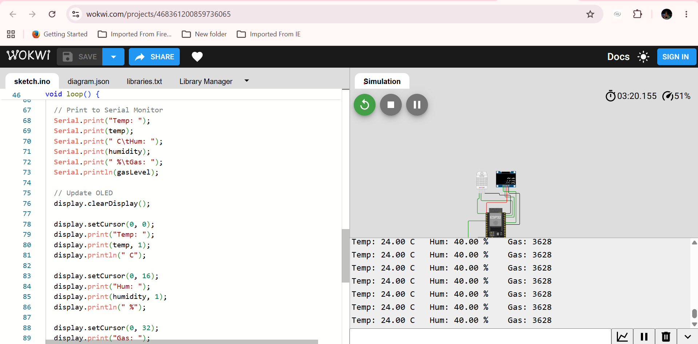
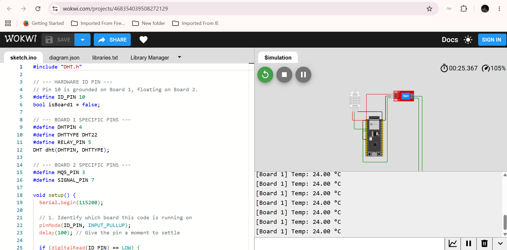
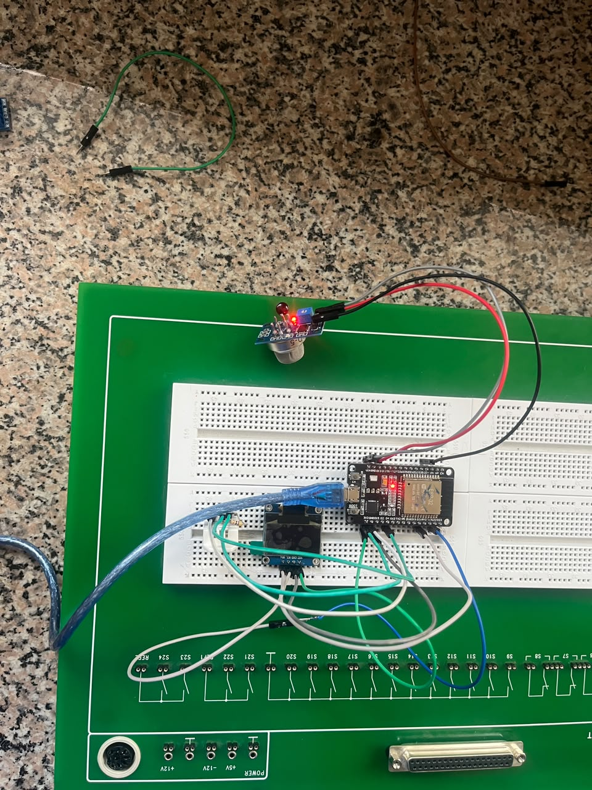
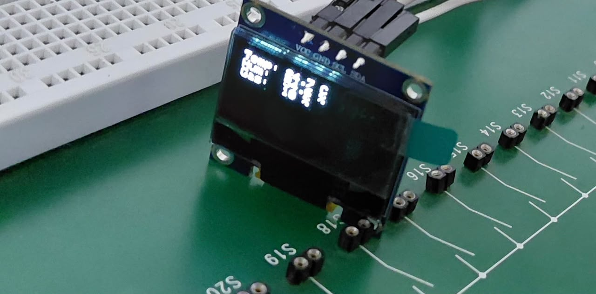
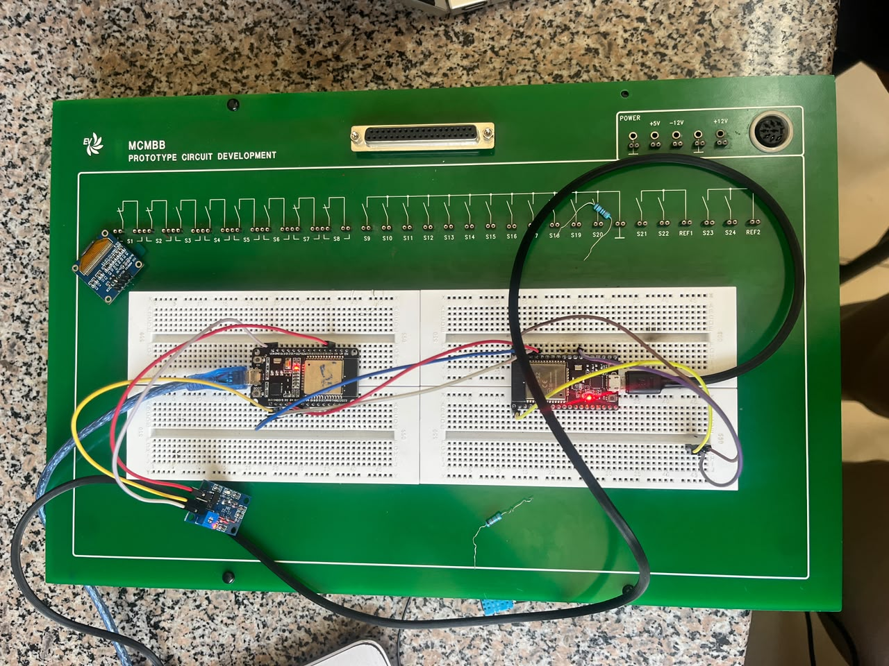

# Flora Farms Greenhouse Monitoring System: Delivarable 2
### **Group Name:** Group 6 (Sunflowers)  
### **Team Members:**
* Kian Muchemi
* Nicole Cheruiyot
* Timon Kisera
* Bridget Muturi
* Trina Kinyua
* Nyambura Wanjohi
* Albert Ngotho

## 1. Project Objective and Strategic Prototype Distribution

The core objective of Deliverable 2 is to realize the abstract hardware schematics designed in Deliverable 1 into working local sensory models. In order to optimize deployment and development times within our strict group timeline, our team leveraged a split implementation scheme combining **Wokwi virtual execution blocks** alongside **physical component integration** inside the university's engineering facility.

To satisfy the task's criteria, our 4 prototype layouts are systematically divided as follows:

| Architecture ID | Core Hardware Component Topology | Prototyping Medium | Implementation Status |
| :--- | :--- | :--- | :--- |
| **Architecture (a)** | 1 × ESP32 + 1 × DHT22 + 1 × MQ-5 + 1 × I2C OLED Display | **Both** Physical & Simulated | Fully Functional / Verified |
| **Architecture (b)** | 1 × ESP32 (MQ-5) wired directly to 1 × ESP32 (DHT22) via UART/GPIO | **Physical Hardware Only** | Fully Functional / Verified |
| **Architecture (c)** | 1 × ESP32 (DHT22) $\rightarrow$ 1 × 5V Relay $\rightarrow$ Secondary ESP32 (MQ-5) | **Simulated Software Only** | Fully Functional / Verified |

---

## 2. Simulated Prototypes (Wokwi Frameworks)

### Architecture (a): 
**Wokwi Simulation URL:** [https://wokwi.com/projects/468361200859736065](https://wokwi.com/projects/468361200859736065)
* **Functional Mechanics:** This setup consolidates localized micro-climate tracking and safety validation into a unified compute unit. The ESP32 utilizes a single-wire digital interface to extract air temperature and relative humidity metrics from the DHT22. Simultaneously, it maps analog gas concentrations via its internal ADC from the MQ-5 sensor lines. These values are buffered, formatted as string matrices, and systematically rendered over an I2C communication bus to map visual readouts directly onto an SSD1306 128x64 OLED screen block.
* **Verified Simulation Output:**

### 2.2 Architecture (c): 
**Wokwi Simulation URL:** [https://wokwi.com/projects/468354039508272129](https://wokwi.com/projects/468354039508272129)
* **Functional Mechanics:** This architecture models data isolation loops designed to offload processing tasks. The primary ESP32 dedicates its cycle exclusively to parsing single-variable metrics from the DHT22 climate sensor. If ambient factors breach safe operational limits, the primary MCU sets an isolated output pin high. This energizes the isolation coil of a 5V Low-Level Trigger Relay Module. The mechanical closure of the relay contacts switches an active input pull-up pin on a secondary, separated ESP32 safety core. This secondary MCU is tasked with managing high-power MQ-5 parsing routines and driving emergency exhaust ventilation relays.
* **Verified Simulation Output:**

## 3. Physical Prototypes

### 3.1 Architecture (a) 

### 3.2 Architecture (b) 
The system successfully established a peer-to-peer data bridge. Below are the images confirming the physical wiring setup and the corresponding serial terminal output generated by executing our code.

## 4. Engineering Challenges and Counter-Measures

During our prototyping phase, the team encountered and resolved two major bottlenecks:

### Challenge 1: Sensor Defect Diagnoses and Validation Log 
During the initial assembly of Architecture (a), the MQ-5 gas sensor lines consistently outputted maximum saturation limits (a flatline raw ADC count of 4095 at 3.3V), completely obscuring changes in ambient air quality. Concurrently, a time-out error for the DHT22 sensor was thrown on our IDE terminal. We performed exhaustive point-to-point diagnostic checks, using a digital multimeter set to continuity mode to test every jumper wire across the breadboard. We also verified the power rails directly across the sensors' VCC and GND pins for a steady 3.3V supply and confirmed our data line pull-up resistors were working correctly. With the interface wires verified, we probed the MQ-5 sensor and discovered its internal heating matrix remained completely cold, drawing under 10 mA—far below its standard 160 mA specification—confirming a broken internal heater coil trace. Similarly, we isolated the DHT22 issue to a defective internal integrated circuit within that specific module. Our team replaced both faulty modules with functional, bench-tested units from the laboratory inventory. This immediately resolved the saturation and timeout errors, successfully restoring our active data loops.

### Challenge 2: Laboratory Scheduling Constraints 
Strict project management constraints threatened our development velocity. Balancing varying group lecture timetables alongside restricted laboratory opening hours severely limited our physical construction and hardware testing windows in the Makerspace facility. To mitigate these constraints and maximize our limited time at the testing bench, the team adopted a "virtual-first" prototype strategy. We structured, compiled, and completely debugged our source code inside the public Wokwi simulator before handling any physical components. This parallel approach ensured that as soon as lab access windows opened, the group could dedicate its full attention to complex physical wiring adjustments, pin mapping, and current verification measurements rather than wasting critical lab time debugging basic syntax code errors.

## 5. System Link-Layer Power Constraints Analysis

Our physical testing confirmed several critical power behavior patterns first identified in our CAT 2 Power Budget calculations:
1. **The Heating Element Overhead:** Bench testing verified that the MQ-5 requires a continuous current draw of $160\text{ mA}$ to maintain its operating temperature. Leaving this element powered indefinitely will quickly exhaust battery reserves during periods without sunlight. To address this, our production code will use a transistor-gating mechanism (P-channel MOSFET) to power down this line during deep-sleep windows.
2. **Topology Impact:** Because a Zigbee mesh configuration requires the radio transceiver to stay continuously awake ($33\text{ mA}$) to route data packets, our software structure favors the MIoTy deployment model, which allows our edge components to completely power down between transmission windows.

---

## 6. Evidence of Groupwork
