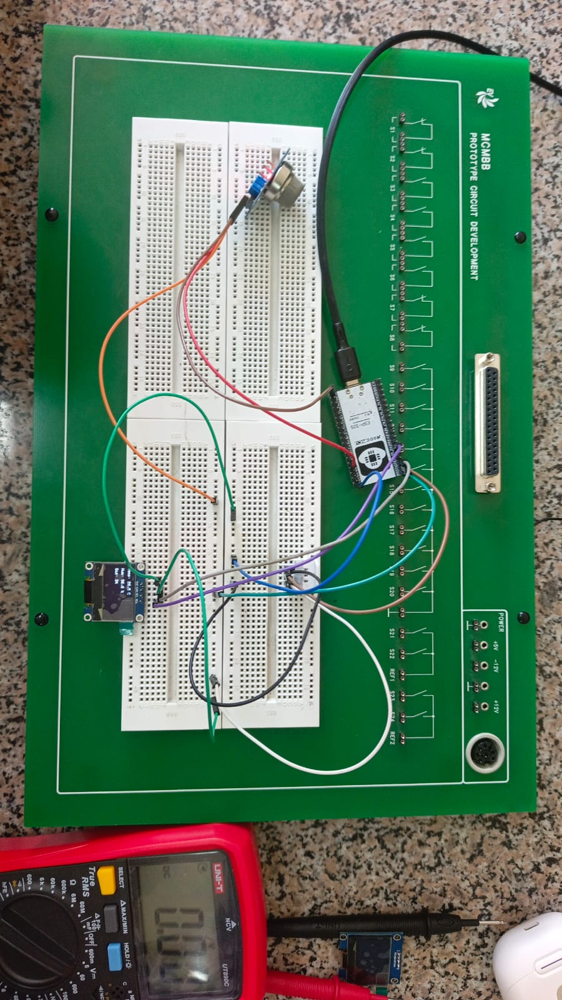
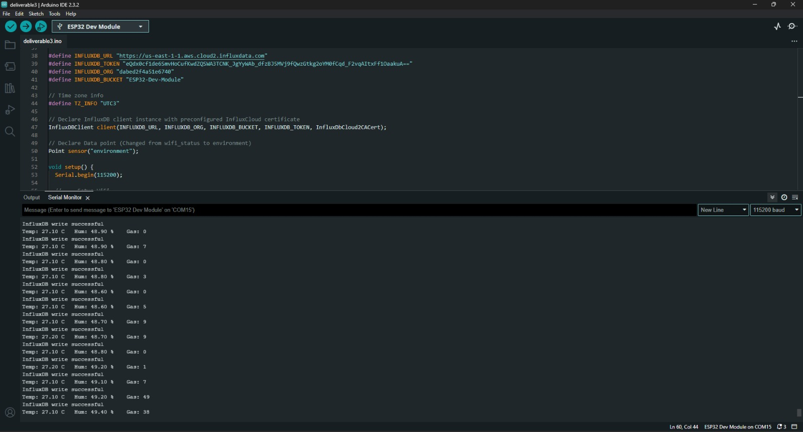
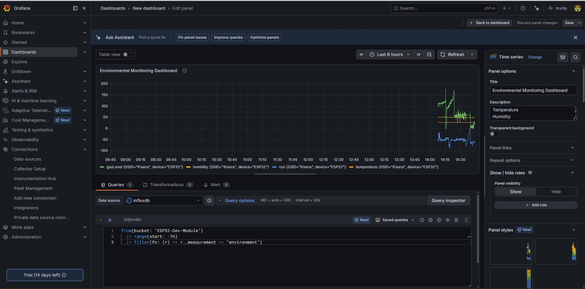
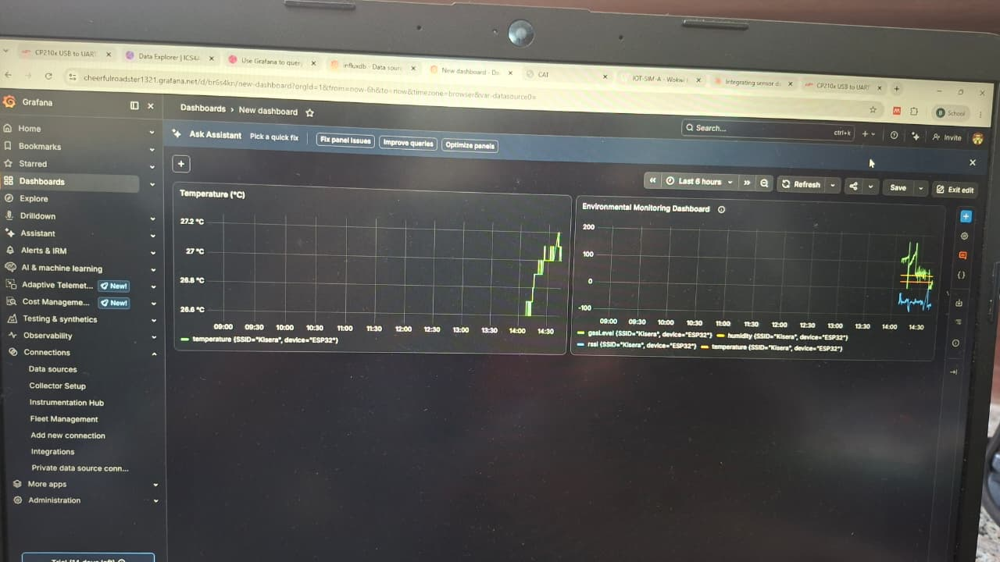
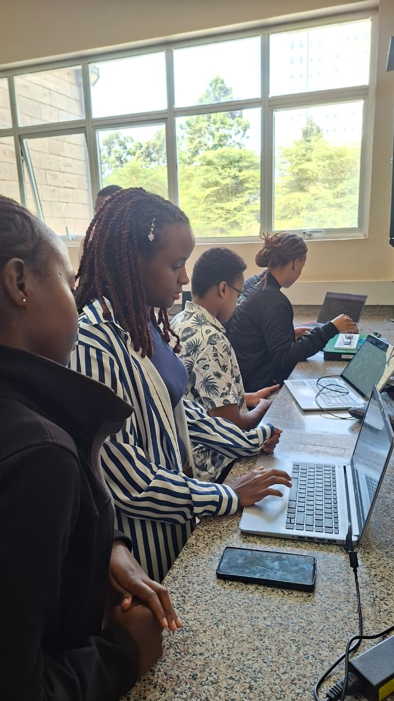

# Flora Farms Greenhouse Monitoring System: Deliverable 3

### **Group Name:** Group 6 (Sunflowers)  
### **Team Members:**
* Kian Muchemi
* Nicole Cheruiyot
* Timon Kisera
* Bridget Muturi
* Trina Kinyua
* Nyambura Wanjohi
* Albert Ngotho

## 1. Objective and Architecture Setup

The primary objective of Deliverable 3 is to advance our localized prototyping into a cloud-connected IoT ecosystem. This phase focuses on establishing live telemetry transmission from our physical greenhouse nodes, saving the streamed metrics into a structured time-series cloud database, and rendering real-time business intelligence dashboards.

Our team successfully built and deployed a **Physical Hardware Architecture** in the Strathmore Makerspace Lab.

### 1.1 Firmware Communication Logic and Connection Trace
The microcontroller firmware incorporates network state verification. Upon power initialization, the ESP32 activates its network interface layer to bind securely to the local gateway via a Wi-Fi station mode link. Once an IP assignment is achieved the core firmware runs sequential non-blocking loop timers to sample data streams. 

Below is the verified hardware compiler log confirmation, demonstrating successful sensor reading initialization, network configuration, local I2C display routing and error free telemetry transmissions to the cloud instance:

## 2. Time-Series Cloud Storage Infrastructure

Unlike relational databases, InfluxDB stores measurements indexed directly by timestamp keys, allowing optimized write throughput and fast compression of chronological data points. Telemetry streams are organized under a strict data schema to optimize queries:
* **Bucket:** `greenhouse_monitoring`
* **Measurement Name:** `environment_metrics`
* **Tags (Indexed Meta-data):** `greenhouse_id=sunflower_01`, `node_type=physical_edge_a`
* **Fields (Dynamic Variables):** `temperature` (Float), `humidity` (Float), and `gas_level` (Integer)

This schema lets us decouple individual nodes across multiple greenhouses while processing microsecond-accurate data histories for our monitoring engine.

## 3. Grafana Analytics Dashboard

Using data queried directly from the InfluxDB engine, we built a real-time tracking interface on **Grafana Cloud** to provide Flora Farms' managers with actionable operational insights. 

Below are the layout screenshots confirming the active cloud telemetry feed and historical trend graphs on our Grafana dashboard:

## 4. Evidence of Groupwork
The team sessions used to build the hardware node, configure the InfluxDB storage metrics and deploy the visual dashboard profiles are confirmed in the images below:

